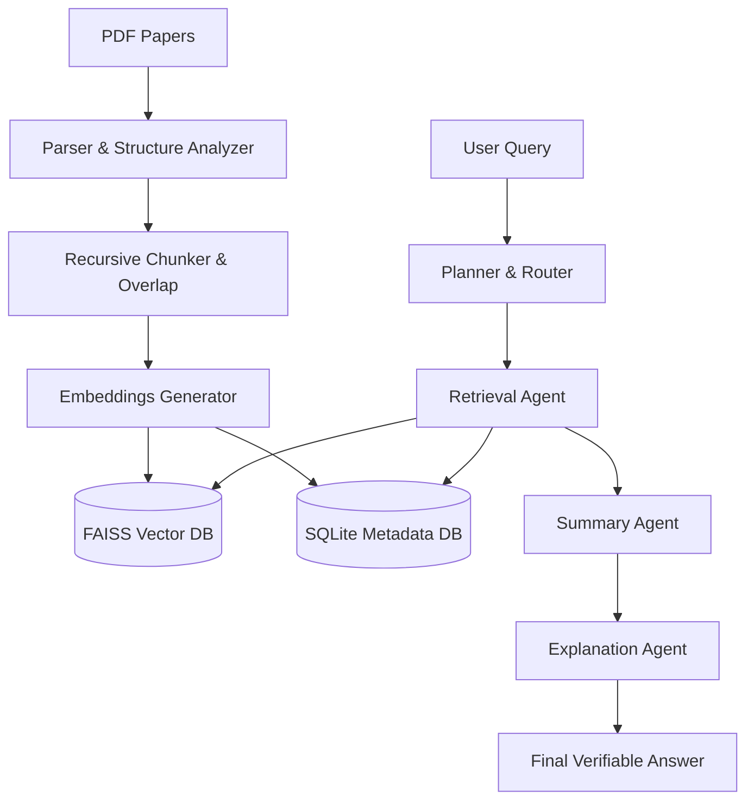

# 📄 Resembler: Academic Research Paper Analyzer

[](https://www.python.org/)
[](https://groq.com/)
[](https://github.com/facebookresearch/faiss)
[](https://github.com/masked-shinobi/MinorProject_resembler)

**Resembler** is a state-of-the-art Multi-Agent RAG (Retrieval-Augmented Generation) system designed specifically for scholars. It doesn't just "chat" with your PDFs; it understands the logical structure of academic research, handles complex tables, and provides scientifically verifiable answers with deep citations.

---

## 🌟 Key Features

*   **🧠 Multi-Agent Orchestration**: Uses a specialized Planner, Router, and dedicated agents (Retrieval, Summary, Explanation) for high-reasoning accuracy.
*   **📐 Structural Awareness**: Automatically identifies logical sections (Abstract, Methodology, Results) to improve retrieval context.
*   **📊 Advanced Evaluation**: Measures 13 distinct scientific metrics including Faithfulness, Semantic Similarity, and NDCG@K.
*   **🛡️ Security Protocol**: Built-in protection against prompt injection and data privacy preservation.
*   **⚡ Groq Integration**: Lightning-fast inference speeds using Groq LPU technology.

---

## 🏗️ System Architecture



---

## 🛠️ Installation

1.  **Clone the repository:**
    ```bash
    git clone https://github.com/masked-shinobi/MinorProject_resembler.git
    cd rag_system
    ```

2.  **Install dependencies:**
    ```bash
    pip install -r requirements.txt
    ```

3.  **Configure `.env`:**
    ```env
    GROQ_API_KEY=your_api_key_here
    ```

---

## 🚀 Usage Guide

### 1. Ingestion Area
Drop your PDFs into `data/papers/` and run:
```bash
python main.py ingest
```

### 2. Analysis & Query
```bash
# Interactive mode for continuous research
python main.py interactive

# Single quick query
python main.py query "Summarize the methodology of the paper on suicide detection."
```

### 3. Scientific Evaluation
Check exactly how well your model is performing:
```bash
python main.py evaluate --all --save
```

---

## 📈 Evaluation Metrics

| Category | Metrics |
| :--- | :--- |
| **Retrieval** | Precision@K, Recall@K, MRR, MAP, NDCG@K, Hit Rate |
| **Generation** | Faithfulness, Completeness, Semantic Similarity, BLEU, ROUGE-L |
| **System** | Total Latency, Step-by-step Breakdown |

---

## 🚧 Roadmap
- [x] Multi-Agent reasoning pipeline
- [x] Comprehensive evaluation metrics
- [x] Security testing layer
- [ ] Multimodal support (Analyzing charts/images)
- [ ] Exportable citation maps

---

> [!IMPORTANT]
> This system is designed for verifiable research. Always use the **Faithfulness Score** provided in the background evaluations to ensure the answers are strictly grounded in your technical documents.

---

### **Built with ❤️ by [masked-shinobi](https://github.com/masked-shinobi)**
*Transforming how we interact with academic knowledge.*
